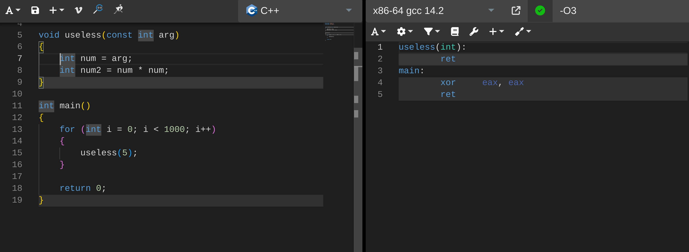
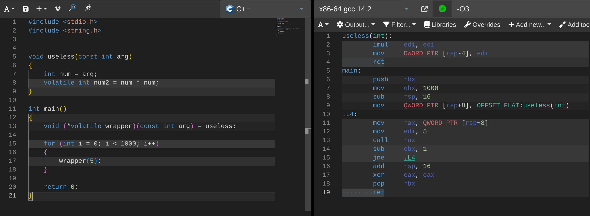

# Оптимизация программ на примере множества Мандельброта

## Что это такое?

Множество Мандельброта - один из самых известных и красивых фракталов, считающийся символом красоты математики. Само по себе оно задаётся простыми выражениями, требующими, тем не менее, больших вычислительных мощностей.

  <tr>
    <td></td>
  </tr>
<table>
  <tr>
    <td></td>
    <td></td>
  </tr> 
  <tr>
    <td></td>
    <td></td>
  </tr>
  <tr>
    <td></td>
    <td></td>
  </tr>
</table>

### Какие точки принадлежат множеству?
Каждой точке $C$ на комплексной плоскости соответствует последовательность точек, каждая из которых вычисляется рекуррентно: $Z_{n+1} = Z_n^2 + C$. Если последовательность ограниченная, то точка принадлежит множеству, иначе - не принадлежит. Поэтому для вычисления каждой точки требуется немалый цикл вычислений. 

## Цель работы
Написать четыре функции расчёта множества Мандельброта с разными уровнями оптимизации:
- Простая функция 0, которая честно рассчитывает каждый пиксель в каждой итерации цикла
- Функция 1, которая рассчитывает по 4 пикселя за одну итерацию цикла
- Функция 2, использующая SIMD-инструкции, так же рассчитывающая по 4 пикселя за итерацию
- Функция 3, развёртывающая цикл обхода пикселей функции 3 с коэффициентом развёртывания k
- Проанализировать, как уровень оптимизации вкупе с методом расчёта влияют на скорость выполнения программ

<!-- ## Ход работы -->

## Информация о программе
### Сборка
Программа написана под Linux и архитектуру Intel (для функций 3 и 4, использующих интринсики). 

Команда терминала для сборки в обычном режиме
```
make
```

#### Флаги компиляции
|                |                                                              |
|----------------|--------------------------------------------------------------|
|`optimize_O0`   | режим оптимизации -O0                                        |
|`optimize_O1`   | режим оптимизации -O1                                        |
|`optimize_O2`   | режим оптимизации -O2                                        |
|`optimize_O3`   | режим оптимизации -O3                                        |
|`no_graphics`   | отключение графики (только расчёты)                          |
|`test_benchmark`| замер скорости функций, результат в файле `res_benchmark.md` |


### Запуск
Команда терминала для запуска в обычном режиме
```
build/mandelbrot
```


#### Флаги при запуске
|                                         |                                               |
|-----------------------------------------|-----------------------------------------------|
|`‑‑use_custom_settings`| Запуск с пользовательскими настройками, лежащими в файле, указанным следующим после флага аргументом (путь относительно директории проекта)|
|`‑‑save_final_settings`| Сохранение пользовательских настроек |
|`--set_rendering_func` | Устанавливает одну из функций расчёта, указанную аргументом после флага. По умолчанию функция 3 |

_Пользовательские настройки - координаты и масштаб в момент сохранения, размеры экрана, а также параметры расчета: радиус границы расчёта и максимальное число итераций цикла расчета. 
Пример конфигурационного файла:_

**benchmark_config.txt**
```
0 		        // offset.x                   
0 		        // offset.y                   
64 		        // max_calc_iterations_num    
2		        // scale                      
9.000000  		// border_radius_sq           
800  		    // window_width               
800  		    // window_heigh           
```

### Управление в обычном режиме
|            |                 |
|------------|-----------------|
| `W`        | движение вверх  |
| `A`        | движение влево  |
| `S`        | движение вниз   |
| `D`        | движение вправо |
| `+`        | приблизиться    |
| `-`        | отдалиться      |

## Ход работы
Целью является с хорошей точностью определить среднее количество тактов, необходимое для расчёта одного кадра. 

Расчёт будет производиться с пользовательскими настройками из файла **benchmark_config.txt**.

Для каждой функции проведём серию из 20 измерений, с флагом -O3 каждое из который рассчитает количество тактов выполнения 200 пикселей. С флагом -O0 в сериях будет по 50 измерений (если делать 20 серий по 200 измерений, то примерное время расчёта будет составлять около трех часов). Измерения проводятся интринсиком `_rdtsc`. Стоит сказать, что, поскольку его задержка равна 17 тактам по документации, время, необходимое на его вызовы пренебрежимо мало с временем, необходимым на расчёт 800*800 пикселей 200 раз.

### Особенности обхода оптимизаций компилятора
Количество тактов на кадр, как было сказано выше, рассчитывается большим циклом, причём сам графический вывод отключён чтобы не учитывать время работы графической библиотеки. Соответственно компилятор, понимая, что вычисления проводятся впустую, выносит вызов функции, делающей одно и то же, за цикл, и выбрасывает вообще содержимое функции. Для иллюстрации приведу пример, отличающийся, по большому счёту, от реальной программы только масштабом.



Здесь показана функция `square`, которая возвращает константное значение и проводит, как компилятору кажется, бесполезные вычисления внутри. В итоговой программе нет ни цикла, ни расчётов функции. Для того, чтобы расчёты всё-таки проводились, нам нужно указать компилятору, что вычисления, связанные с этой переменной, нельзя оптимизировать. Для этого используем `volatile`:


Но мы видим, что компилятор оптимизирует цикл, вынося за его границы функцию (ещё и инлайня её). Для того, чтобы этого не происходило, мы должны пометить словом `volatile` и её:



После этого программа не выбрасывает то, что нам нужно. В моей программе это реализуется тем, что основная переменная - счётчик числа итераций для конкретного пикселя - помечается словом `volatile`.


Результаты измерений приведены в таблицах.

### _Уровень оптимизации `-O3`_, $такты/кадр *10^7$  

|**№ \ функция**| **функция 0** | **функция 1** | **функция 2**|**функция 3 (k = 8)** | **функция 3 (k = 4)** | **функция 3 (k = 2)** |
|-------------|-----------|---------- |----------|------------------|-------------------|-------------------|
| **1**         |  37,51    |  5,07     |  2,96    |  2,83            |  2,02             |  2,06             |
| **2**         |  37,28    |  5,06     |  2,96    |  2,77            |  2,01             |  1,98             |
| **3**         |  36,35    |  5,52     |  2,96    |  2,77            |  2,02             |  1,96             |
| **4**         |  36,36    |  5,08     |  3,16    |  2,75            |  2,02             |  1,95             |
| **5**         |  38,42    |  5,09     |  3,43    |  2,75            |  2,02             |  1,95             |
| **6**         |  37,13    |  5,08     |  2,96    |  2,75            |  2,02             |  1,96             |
| **7**         |  38,56    |  5,08     |  2,96    |  2,76            |  2,03             |  1,96             |
| **8**         |  37,44    |  5,52     |  2,96    |  2,75            |  2,03             |  1,96             |
| **9**         |  37,31    |  5,07     |  2,96    |  2,75            |  2,01             |  1,96             |
| **10**        |  37,73    |  6,01     |  2,96    |  2,75            |  2,02             |  1,96             |
| **11**        |  37,81    |  5,09     |  2,96    |  2,75            |  2,51             |  1,95             |
| **12**        |  37,49    |  5,08     |  2,96    |  2,75            |  2,37             |  1,96             |
| **13**        |  37,37    |  5,08     |  2,96    |  2,75            |  2,02             |  1,97             |
| **14**        |  37,6     |  5,08     |  2,96    |  2,75            |  2,74             |  1,96             |
| **15**        |  37,51    |  5,52     |  3,4     |  2,75            |  2,02             |  1,96             |
| **16**        |  37,04    |  5,07     |  2,97    |  2,76            |  2,02             |  1,96             |
| **17**        |  36,91    |  5,06     |  2,96    |  2,75            |  2,02             |  1,96             |
| **18**        |  36,49    |  5,07     |  3,41    |  2,76            |  2,2              |  1,96             |
| **19**        |  36,51    |  5,06     |  2,96    |  2,75            |  2,26             |  1,97             |
| **20**        |  37,31    |  5,07     |  2,96    |  2,75            |  2,01             |  1,95             |
|               |           |           |          |                  |                   |                   |
| **Среднее**   | 37,31   | 5,19   | 3,04   | 2,76          | 2,12          | 1,97          |
| **Среднекв. погрешность** | 0,14    | 0,06   | 0,04   | 0,00          | 0,05          | 0,01          |
| **Сист. погрешность** | 0,05    | 0,05   | 0,05   | 0,05          | 0,05          | 0,05          |
| **Полн. погрешность** | 0,15    | 0,08   | 0,06   | 0,05          | 0,07          | 0,05          |


### Построенные по таблице графики

_общий вид_


_акцент на быстрые функции_ (func3_k _n_ - развертывание на _n_ функции 3)


###  _Уровень оптимизации `-O0`_, $такты/кадр *10^8$  
|**№ \ функция**| **функция 0** | **функция 1** | **функция 2**|**функция 3 (k = 8)** | **функция 3 (k = 4)** | **функция 3 (k = 2)** |
|-------------|-----------|---------- |----------|------------------|-------------------|-------------------|
| **1**         |  15,1    |  4,9      |  1,56    |  1,22            |  1,26             |  1,35             |
| **2**         |  15,0    |  4,89     |  1,55    |  1,22            |  1,24             |  1,30             |
| **3**         |  15,0    |  4,87     |  1,55    |  1,22            |  1,24             |  1,30             |
| **4**         |  15,0    |  4,86     |  1,55    |  1,22            |  1,25             |  1,30             |
| **5**         |  15,1    |  4,86     |  1,55    |  1,22            |  1,23             |  1,30             |
| **6**         |  15,0    |  4,86     |  1,55    |  1,22            |  1,23             |  1,30             |
| **7**         |  15,1    |  4,86     |  1,55    |  1,22            |  1,25             |  1,30             |
| **8**         |  15,1    |  4,86     |  1,55    |  1,22            |  1,24             |  1,30             |
| **9**         |  15,0    |  4,87     |  1,55    |  1,22            |  1,23             |  1,30             |
| **10**        |  15,0    |  4,89     |  1,55    |  1,22            |  1,23             |  1,30             |
| **11**        |  15,0    |  4,87     |  1,55    |  1,22            |  1,23             |  1,30             |
| **12**        |  15,1    |  4,89     |  1,55    |  1,22            |  1,23             |  1,30             |
| **13**        |  15,1    |  4,87     |  1,55    |  1,22            |  1,23             |  1,30             |
| **14**        |  15,0    |  4,93     |  1,55    |  1,22            |  1,23             |  1,30             |
| **15**        |  15,0    |  4,9      |  1,55    |  1,22            |  1,23             |  1,30             |
| **16**        |  15,0    |  4,87     |  1,55    |  1,22            |  1,23             |  1,30             |
| **17**        |  15,0    |  4,87     |  1,55    |  1,22            |  1,23             |  1,30             |
| **18**        |  15,1    |  4,87     |  1,55    |  1,22            |  1,23             |  1,30             |
| **19**        |  15,1    |  4,89     |  1,55    |  1,22            |  1,23             |  1,30             |
| **20**        |  15,1    |  4,88     |  1,55    |  1,22            |  1,23             |  1,30             |
|               |           |           |          |                  |                   |                   |
| **Среднее**   | 15,05    | 4,88     | 1,55    | 1,22            | 1,24             | 1,30             |
| **Среднекв. погрешность** | 0,01    | 0,00     | 0,00    | 0,00            | 0,00             | 0,00             |
| **Сист. погрешность** | 0,05    | 0,05     | 0,05    | 0,05            | 0,05             | 0,05             |
| **Полн. погрешность** | 0,05    | 0,05     | 0,05    | 0,05            | 0,05             | 0,05             |


_общий вид_


_акцент на быстрые функции_ (производительность при развёртывании третьей функции на k = 2, 4, 8 практически совпадает)


## Выводы
В ходе работы мы измерили время работы функций расчёта множества Мандельброта и получили результат с хорошей погрешностью. 

Итого, мы получили, что функция `func1` расчёта по 4 пикселя за итерацию цикла действительно оказалась быстрее "наивной" `func0`. Более того, мы смогли исследовать, как влияет развёртывание цикла в функции `func3` и пришли к выводу, что развёртывание на $k = 2$ оказалось оптимальным. Возможно, это связано с тем, что при большем развёртывании процессору не хватает необходимых регистров, и ему приходится сохранять данные в память и обращаться к ней, что замедляет время работы программы.

Зная устройство конвейера процессора и используя ассемблерные вставки в функциях `func2` и `func3` мы добились впечатляющего результата - улучшения производительности программы почти в 20 раз ($37.31*10^7 -> 1.97*10^7$ тактов/кадр).